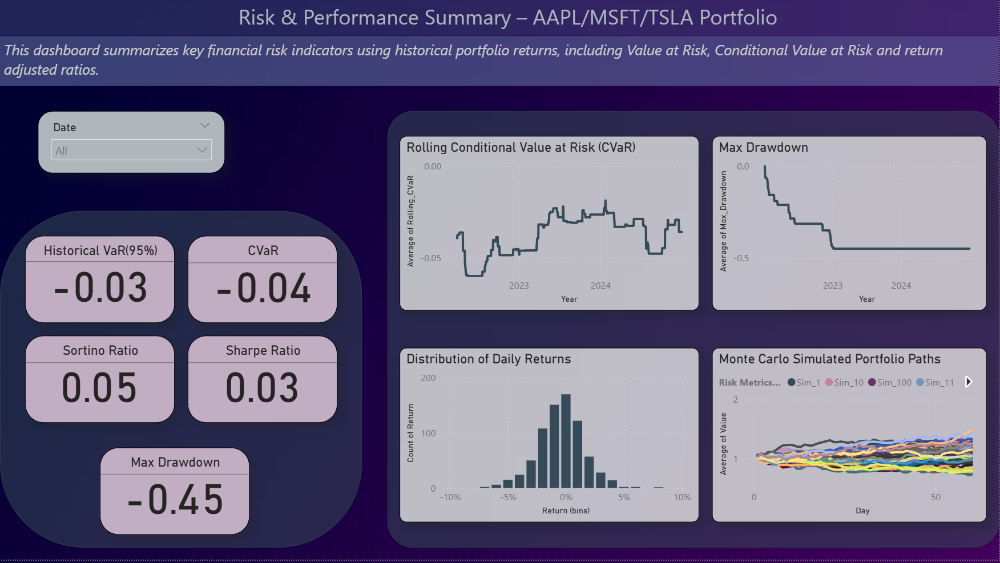

#  Portfolio Risk Analysis using VaR, CVaR, Sharpe Ratio & Monte Carlo Simulation

This project explores the financial risk profile of a stock portfolio using Python and Power BI. It covers a range of risk metrics — from basic Value at Risk (VaR) to advanced techniques like Conditional VaR (CVaR), rolling drawdowns, Sharpe/Sortino ratios, and Monte Carlo simulations. Results are visualized through interactive Power BI dashboards and compiled into a professional PDF report.

---

##  Project Highlights

### ✅ Data
- Historical stock data fetched using `yfinance`
- Assets include individual stocks or ETFs (customizable)
- [sample data](https://github.com/intheperkofextinction/VaR-for-portfolio/blob/main/portfolio_daily_returns.csv)

### ✅ Risk Metrics & Analysis Performed
- Value at Risk (VaR) at 95% confidence
- Conditional Value at Risk (CVaR)
- Rolling CVaR and Drawdown visualization
- Sharpe & Sortino Ratios for risk-adjusted return evaluation
- Stress Testing using time window slicing
- Monte Carlo Simulation to forecast 60-day portfolio behavior

###  Dashboard (Power BI)
- 4 interactive pages:
  1. **Dashboard**
  2. **Summary**: KPI cards for VaR, CVaR, Max Drawdown, Sharpe, Sortino
  3. **Risk Over Time**: Rolling CVaR and drawdown charts
  4. **Distribution & Simulation**: Daily return distribution and Monte Carlo forecast paths

> A full PDF report was generated to explain the methods and interpretation of results.> 
[pdf](https://github.com/intheperkofextinction/VaR-for-portfolio/blob/main/Advanced%20Portfolio%20Risk%20Analysis%20(1).pdf)

---

## Tech Stack

- **Language**: Python (Pandas, NumPy, Matplotlib, Seaborn)
- **Data Source**: Yahoo Finance via `yfinance`
- **Visualization**: Power BI
- **Documentation**: PDF report with technical and business interpretation

---

##  Project Structure

```
 portfolio-risk-analysis/
├── notebooks/
│ ├── basic_var.ipynb
│ ├── advanced_risk_metrics.ipynb
│ └── monte_carlo_export.ipynb
├── data/
│ └── cleaned_returns.csv
├── powerbi/
│ └── portfolio_dashboard.pbix
├── report/
│ └── Advanced Portfolio Risk Analysis.pdf
├── screenshots/
│ └── dashboard_preview.png
├── README.md
└── requirements.txt
```
---

##  Key Insights



- The portfolio exhibits moderate volatility with rare but notable tail risks.
- Monte Carlo simulations highlight the probability of both upward and downward trends, helping assess expected uncertainty.
- Power BI allows dynamic visualization and stakeholder-friendly reporting.

---

